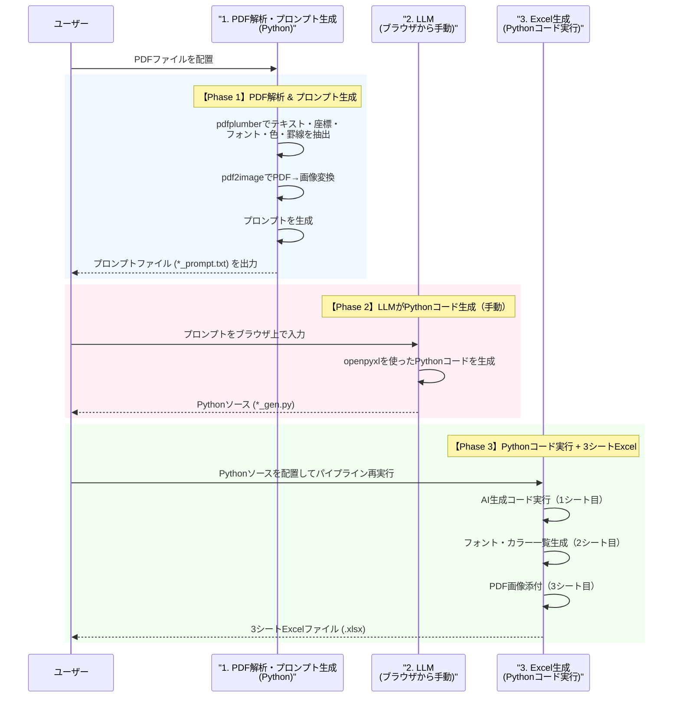
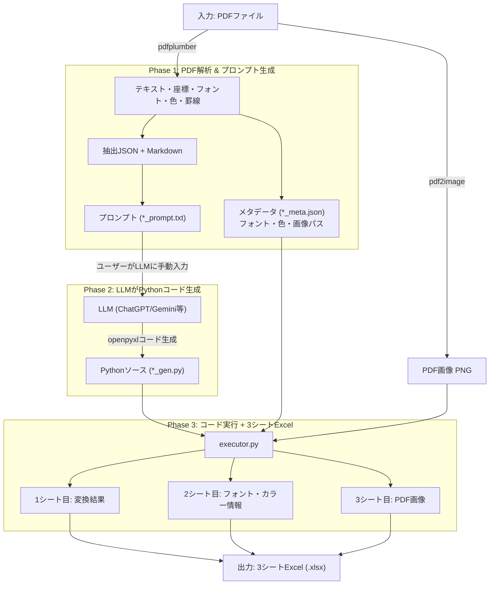

# Sheetling アーキテクチャ設計

PDF→Excel変換を「PDF解析→AI(LLM)がPythonソース出力→実行で3シートExcel生成」の3フェーズで行うシステム。

## 全体アーキテクチャ図

## データフロー図

## 各モジュールの役割

1. **`src/core/extractor.py`**
   - 【Phase 1】`pdfplumber` を使用してPDFからテキスト・座標(bbox)・フォント名・サイズ・色・罫線・矩形を抽出。JSON/Markdown形式で出力。

2. **`src/core/image_converter.py`**
   - 【Phase 1】`pdf2image`（poppler）でPDFを画像(PNG)に変換。3シート目用。

3. **`src/core/prompts.py`**
   - 【Phase 1】AIにopenpyxlベースのPythonコード（`generate(wb, ws)` 関数）を出力させるプロンプトを生成。座標変換ルールと利用可能なライブラリの情報を含む。

4. **`src/core/pipeline.py`**
   - 【Phase 1/3】各モジュールを統合。Phase1では解析→プロンプト生成、Phase3ではAIコード実行→3シートExcel生成。

5. **`src/core/executor.py`**
   - 【Phase 3】AI出力のPythonソースを`exec()`で実行し、1シート目を描画。2シート目（フォント・カラー一覧）と3シート目（PDF画像）を自動付加して3シートExcelを出力。

6. **`src/core/schema.py`**
   - 【共通】PDF抽出結果の型定義（Pydanticモデル）。

7. **`src/core/config.py`**
   - 【共通】方眼サイズ(4.96pt)、列数(120)、行数(176)等の設定値。

## 3シート構成

| シート | 名前 | 内容 | 生成元 |
|--------|------|------|--------|
| 1 | 変換結果 | AIがPDFレイアウトを再現 | AI生成Pythonコード |
| 2 | フォント・カラー情報 | 使用フォント一覧 + カラーコード一覧 | 自動（extractor抽出データ） |
| 3 | PDF画像 | PDFの各ページ画像 | 自動（pdf2image） |
